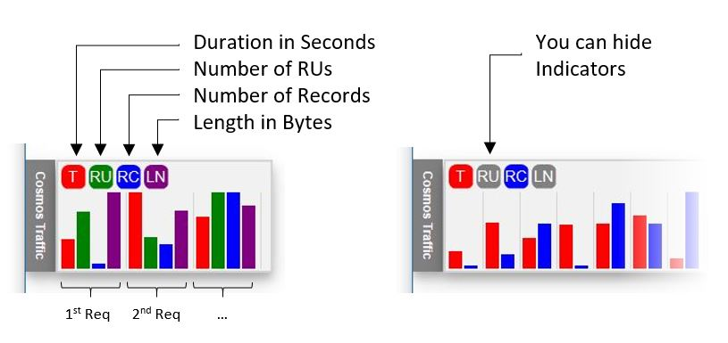

# CosmosDBTraffic
A widget to speed the development of HTML applications that connect to CosmosDB 

## Why this solution

A web application should have the architecture of 3 tiers at least:

*HTML+Javascript* <-> *API(Data Interface)* <-> *Database*

When we are doing quick prototyping and development of the Database and frontend, the API layer can be a bottleneck. A common solution is to define clear contracts and initialize the API layer with data mockups.
While this is easy, it takes some time and the information is always static.
Change or tuning of requirements can lead to frustrating changes of contracts and of API code.

To improve the time to market of a prototype we came with a solution focused on the frontend development. This should always be used in a secure network environment and consist of:
- Start developing the frontend
- Embed CosmosDB instructions in the code in a separate javascript file
- Test it live against CosmosDB on Azure or on the emulator
- Check performance and RUs
- When happy with the queries and collections, move the APIs to Azure Functions or other middleware of choice.

This approach provides:
- Quick prototyping and quick app development.
- An easy way to see cost of CosmosDB instructions.
- Immediate identification of speed, cost and Cosmos resources used.

All the CosmosDB queries become visible and real time in a Widget in your webpage. This widget displays:


Clicking on a column will write the query instruction in the browser console.

Important notes:
- this lib should only be used in development and under a secure network environment as it exposes the database to the HTML/Javascript client.
- There is no security aspect implemented. You can add it but the objective is always to have this in a dev and secure network environment.

### Check it in action

In the Sample folder you have two samples:
- demo dummy.html - a fake CosmosDB simulator just to demo the client widget in action
- demo.html - a ready to run sample that queries the local CosmosDB emulator


## How to use it

To have this running in your project you need:
1. Add two files to your webpage
   
``` html
<script src="../Client/CosmosDBTraffic.js"></script>
<link href="../Client/CosmosDBTraffic.css" rel="stylesheet">
```

2. Initialize the widget

```javascript
CosmosDBTraffic.init();
```

3. Add the telemetry to the server calls or use the provided REST functions.

You can add your own telemetry:

``` javascript
CosmosDBTraffic.add([duration, RUs, numberOfBytes , length, messageToDisplay, URLforDebug]);
```

or use the REST functions iunclude and run the Azure Functions proxy in your machine.
To do this you need to:
1. Run the Azure Functions project in VSCode or full Visual Studio
2. Do CosmosDB queries using the *CosmosDBTraffic.query* and *CosmosDBTraffic.upsert* functions from your code.

Query Sample:
```javascript
//optional line, you can point the APIHOST to any other existing endpoint
CosmosDBTraffic.APIHOST="http://localhost:7071/api/";
//execute a "SELECT TOP 1 * FROM c" query on the database "TodoList" and collection "Items". Comment it with my "ToDoList Select"
    var result=await CosmosDBTraffic.query(
        "ToDoList",
        "Items",
        "SELECT TOP 1 * FROM c" ,
        "my ToDoList Select"
        );
````

Note: to use the REST functions you need to have jquery added to your page


## Components

The solution can be used just with the client libraries or with the server component that is a proxy to CosmosDB

### Client

You can customize the stylesheet.

``` html
<script src="../Client/CosmosDBTraffic.js"></script>
<link href="../Client/CosmosDBTraffic.css" rel="stylesheet">
```

### Server

The Server component is the proxy to CosmosDB. It enables queries and update or inserts.

It is a pass thru API that embelishes the response with statistical information to enable the widget to display data.

It's an Azure Function written in C# in .NET Core that can be deployed in a conventional server or translated into any other language. As this is intended to be used as a development tool, it's just a fire and forget function that you have running in your machine without any need to deploy on Azure or server side.

Having it deployed on Azure will decrease the latency calls when you have a lot of CosmosDB calls, delivering a closer to production experience.
You should see impact in latency if you are developing in your local CosmosDB emulator.

Again, keep in mind the security considerations of doing this.

The local.settings.json will need to have two sections: enable CORS and the CosmosDB keys:

```json
{
  "IsEncrypted": false,
  "Values": {
    "AzureWebJobsStorage": "",
    "FUNCTIONS_WORKER_RUNTIME": "dotnet",
    "KEY": "C2... ...Jw==",
    "URL": "https://localhost:8081/"
  },
  "Host": {
    "CORS": "*"
  }
}
```

## Javascript function reference

### CosmosDBTraffic

#### Methods

*init([APIURL])*

Initializes the widget. Called only once.
The default APIURL is "http://localhost:7071/api/"

Example:
```
CosmosDBTraffic.init();
```   
or
```
CosmosDBTraffic.init('http://localhost:8080/api/');
```

*Add(record)*

Add a traffic record to the traffic list.
The record has this format:
```
[time, RU, NREC, BYTES, comment, URL]
```

### CosmosDB commands

*query(database, collection, query, message)*

Returns the query result.

Example:
```
var query="select * from c where c.id='test'";
var result=await CosmosDBTraffic.query("ToDoList","Items",query,"Retrieving all records with test");
```

*upsert(database, collection, record, partitionKeyValue, message)*

Inserts or Updates a item

Example:
```
var item='{"text":"I am a test item", "id":"testid", "pkey":"test"}';
var result=await CosmosDBTraffic.upsert("ToDoList","Items",item,"test", "Insert an item");
```


*delete(database, collection, id, partitionKeyValue, message)*

Deletes an item

Example:
```
var result=await CosmosDBTraffic.delete("ToDoList","Items","testid","test","Delete item");
```
